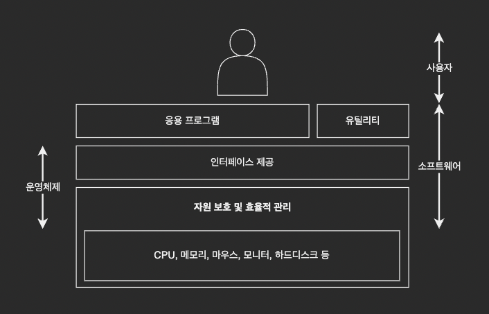

# 운영체제 소개

## 일상생활 속 운영체제

- 스마트폰 운영체제
    - IOS, 안드로이드
- 컴퓨터 운영체제
    - Windows, Mac OS, Unix, Linux 등
- 임베디드 운영체제(CPU의 성능이 낮고, 메모리 크기도 작은 시스템에 내장)
    - MP3플레이어, 내비게이션, PMP, 전자사전, 스마트 TV 등

## 운영체제 필요성

메모리, CPU 등의 성능이 향상되고, 여러 작업을 동시에 할 수 있는 컴퓨팅 환경이 조성되면서 사용 규칙이 필요해졌다.  
복잡한 작업 환경에 규칙이 없으면 기계를 망가뜨릴 수 있기 때문에 등장했다.

### 관련 질문

| 질문                            | 답                                                                       |
|-------------------------------|-------------------------------------------------------------------------|
| 컴퓨터는 운영체제가 없어도 작동하는가?         | 컴퓨터는 운영체제가 없어도 작동하지만 기능 제약이 따른다.                                        |
| 운영체제가 있는 기계와 없는 기계의 차이        | 운영체제가 있는 기계는 다양한 응용 프로그램을 설치하여 사용할 수 있고, 성능 향상을 위한 새로운 기능을 쉽게 추가할 수 있다. |
| 운영체제는 성능 향상하는 데에만 필요한가?       | 운영체제는 컴퓨터 성능 향상 뿐 아니라 자원을 관리하고, 사용자에게 편리한 인터페이스 환경을 제공한다.               |
| 운영체제는 자원을 어떻게 관리하는가?          | 운영체제는 사용자가 직접 자원에 접근하는 것을 막음으로써 컴퓨터 자원을 보호한다.                           |
| 사용자는 숨어 있는 자원을 어떻게 이용할 수 있는가? | 운영체제가 제공하는 사용자 인터페이스와 하드웨어 인터페이스를 이용하여 자원에 접근한다.                        |

## 운영체제의 정의

> 사용자에게 편리한 인터페이스 환경 제공 + 컴퓨터 시스템의 자원을 효율적 관리 + 자원 보호하는 소프트웨어

## 운영체제 역할

### 자원 관리

응용 프로그램에 자원을 나누어 주어 사용자가 원활하게 작업할 수 있도록 돕는다. 여러 응용 프로그램에서 요청이 온다면 적당한 순서로 배분하고, 적절한 시점에 자원을 회수하여 다른 응용 프로그램에 나누어 준다.

### 자원 보호

악의적인 사용자나 미숙한 사용자로부터 자원을 보호하는 것도 매우 중요하다. 어떤 응용 프로그램이 남의 영역을 침범한다면 다른 사람의 작업을 망치거나 데이터를 지울 수도 있기 때문에
비정상적인 작업으로부터 컴퓨터 자원을 지키는 것도 운영체제의 역할 중 하나이다.

### 하드웨어 인터페이스 제공

복잡한 과정 없이 다양한 장치를 사용할 수 있도록 CPU, 메모리, 키보드, 마우스와 같은 다양한 하드웨어를 일관된 방법으로 지원한다. 때문에 어떤 회사에서 만든 하드웨어인지 신경 쓸 필요가 없다.

하드웨어 인터페이스 지원은 드라이버를 컴퓨터에 설치해야 가능하다. 드라이버는 하드웨어 장치와 상호작용하기 위해 만들어진 컴퓨터 프로그램으로 장치 드라이버, 디바이스 드라이버, 장치 제어기, 소프트웨어 드라이버라고도 부른다.  
드라이버는 운영체제 설치 시 자동으로 설치되지만 일부 하드웨어의 경우 따로 설치해야 하는데, 이러한 드라이버를 하드웨어 인터페이스라고 한다.

### 사용자 인터페이스 제공

사용자가 운영체제를 편리하게 사용하도록 지원하기 위한 것이다. 요즘에는 그래픽 사용자 인터페이스(GUI)를 제공하므로 대부분의 작업을 마우스로 수행하는 등 운영체제를 편리하게 사용할 수 있도록 제공되는 이런 기술을 사용자 인터페이스라고 한다.

## 운영체제 목표

> 효율성(자원 관리) + 안정성(자원 보호) + 확장성(하드웨어 인터페이스 제공, 플러그 앤 플레이) + 편리성

| 운영체제 목표 | 운영체제 역할       |
|---------|---------------|
| 효율성     | 자원 관리         |
| 안정성     | 자원 보호         |
| 확장성     | 하드웨어 인터페이스 제공 |
| 편리성     | 사용자 인터페이스 제공  |