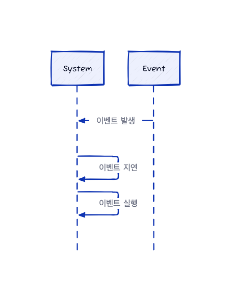

# 실시간 CPU 스케줄링(Real-Time CPU Scheduling)

Real-Time 운영체제에서 CPU를 스케줄링할 때 고려해야 하는 두가지 쟁점이 존재한다.

- Soft Real-Time
    - 정해진 시간은 있지만 이 시간을 조금 어겨도 문제는 없음
    - ex, 비디오 스트리밍, 게임, 실시간 채팅 등
- Hard Real-Time
    - 정해진 시간 안에 반드시 완료되어야 함
    - ex, 항공기 제어, 의료 장비, 원자로 제어 등

## 지연 시간 최소화

이벤트는 SW, HW에 의해서 발생이 된다. 이벤트가 발생하면 시스템은 가능한 빨리 그에 응답하고 그에 맞는 동작을 수행해야 한다. 이벤트 지연시간은 이벤트가 발생 후 그에 맞는 동작을 수행하기 까지의 시간을 말한다.

    

이 때 두 가지 유형의 지연시간이 존재한다.

1. 인터럽트 지연시간(**Interrupt Delay-Time)**
    1. CPU에 인터럽트가 발생한 시점부터 해당 인터럽트 처리 루틴이 시작하기까지의 시간
2. 디스패치 지연시간(**Dispatch Delay-Time**)
    1. 스케줄링 디스패처가 하나의 프로세스를 블록시키고 다른 프로세스를 시작하는 데까지 걸리는 시간

CPU를 즉시 사용해야 하는 실시간 Task가 있다면, 실시간 운영체제는 이 지연 시간을 최소화해야 한다. 디스패치 지연 시간을 최소화하는 가장 효과적인 방법은 선점형 커널이다.

## 우선순위 기반 스케줄링(Priority Based Scheduling)

실시간 운영체제에서는 응답 시간이 매우 중요하며, 특히 실시간 프로세스들이 적시에 CPU 자원을 확보할 수 있도록 하는 것이 필수적이다. 이를 위해 우선순위 기반 스케줄링이 활용된다.

우선순위 기반 스케줄링은 각 프로세스에 우선순위를 부여하고, 이 우선순위에 따라 CPU 접근 권한을 결정하는 방법입니다. 중요한 Task는 높은 우선순위를 받아 더 낮은 우선순위의 Task보다 먼저 처리된다. 특히 선점형 스케줄러를 사용하는 경우 현재 실행 중인 프로세스가 더 높은 우선순위의 프로세스에 의해 중단되고 대체될 수 있다.

하지만 이러한 선점형 우선순위 기반 스케줄링은 Soft Real-Time 시스템에서 효과적이지만, Hard Real-Time 시스템에서는 프로세스가 마감시간 내에 확실하게 수행되어야 하기 때문에 이를 위해 더 복잡한 스케줄링 기법이 필요하다.

Hard Real-Time 스케줄링에서는 일정한 간격으로 CPU 시간을 필요로 하며, 각각 고정된 실행 시간, 마감시간, 그리고 주기를 가지고 있다. 스케줄러는 이러한 특성을 바탕으로 프로세스의 우선순위를 결정하고, 실행 빈도가 주기의 역수인 이 프로세스들을 효과적으로 관리한다. 
또한 프로세스가 자신의 마감시간을 스케줄러에게 알릴 필요가 있을 수 있으며, 이 경우 승인 제어 알고리즘을 사용하여 마감시간 내에 완료 가능한 프로세스만 실행을 허가하고, 그렇지 않은 경우 실행을 거절함으로써 시스템의 신뢰성과 효율성을 보장한다. 이러한 접근 방식은 주기적인 프로세스를 다루는 Hard Real-Time 시스템에서는 필수적인 기술로, 시스템의 성능을 최적화하고 안정적인 작업 실행을 보장하는 데 큰 도움이 됩니다.

## Rate-Monotonic 스케줄링(Rate Monotonic Scheduling)

Rate-Monotonic 스케줄링은 Real-Time 운영 체제에서 주기적인 Task를 관리하기 위해 널리 사용되는 선점 가능한 정적 우선순위 스케줄링 방법이다. 이 방법은 각 Task에 주기를 기반으로 우선순위를 부여하며 주기가 짧은 Task에게 높은 우선순위를 부여한다. 

CPU 이용률을 계산하여 스케줄링 가능성을 평가하며 높은 우선순위의 Task가 준비되면 낮은 우선순위의 Task를 선점하여 CPU 자원을 효율적으로 사용하고 마감시간을 만족시키는 데 도움을 준다. 이 방법은 Task 수의 증가와 CPU 이용률의 한계를 고려해야 하는 중요한 요소를 가지고 있지만 올바르게 적용될 경우 Real-Time 시스템의 성능을 향상시키는 효과적인 스케줄링 솔루션을 제공한다.