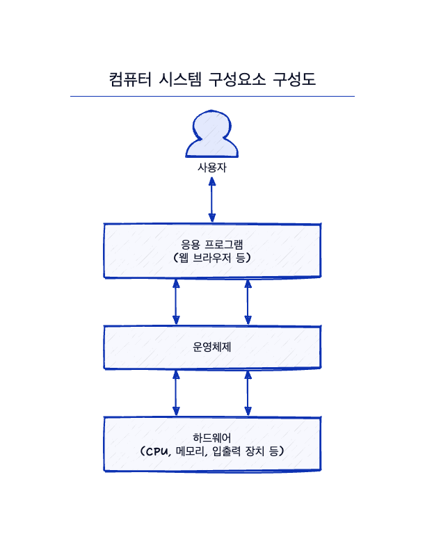

# 운영체제가 할 일

    

- Computer System은 하드웨어, 운영체제, 응용 프로그램, 사용자로 구분된다.

    1. 하드웨어(Hardware) : CPU(프로세서), 메모리, I/O (입출력 장치)로 구성되어 기본 계산용 자원을 제공

    2. 운영체제(OS) : 응용 프로그램과 하드웨어 간의 사용을 제어하고 조정한다.

    3. 응용 프로그램 : 워드 프로세서, 스프레드 시트, 컴파일러 등. 이들 자원이 어떻게 사용될지 결정

- Computer System은 하드웨어, 소프트웨어, 데이터로 구성되었다고 볼 수도 있다.

- 운영체제는 컴퓨터 시스템이 동작할 때, 이들 자원을 적절하게 사용할 수 있는 방법을 제공한다.

- 운영체제는 다른 프로그램이 유용하게 사용할 수 있는 `환경`을 제공한다.

## 사용자 관점(User View)

Computer 사용자의 관점은 사용되는 Interface에 따라 달라지지만 일반적으로 PC가 많이 이용되므로 
System은 한 사용자가 자원을 독점하도록 설계되었으며, 사용자가 수행하는 작업을 최대화하는 게 목표이다. 

이 경우, `사용의 용이성`을 위해 설계되고, `자원의 이용`의 효율성에는 전혀 신경을 쓰지 않는다.

## 시스템 관점(System View)

- 운영체제는 하드웨어와 가장 밀접한 프로그램이며, 운영체제를 Resource Allocator(자원 할당자)로 볼 수 있다.

- 운영체제는 CPU Time, 메모리 공간, 저장장치 공간, 입출력 장치 등을 효율적으로 사용하기 위한 자원의 관리자 역할을 수행한다.

- 운영체제는 `제어 프로그램(Control Program)`으로, 입출력 장치의 제어와 작동에 깊이 관여한다.

## 운영체제의 정의

- 운영체제는 컴퓨터 시스템의 자원을 효율적으로 관리하며, 사용자가 컴퓨터를 편리하고 효과적으로 사용할 수 있도록 환경을 제공하는 여러 프로그램의 모임이다.

## 참고

- 공룡책 1장
