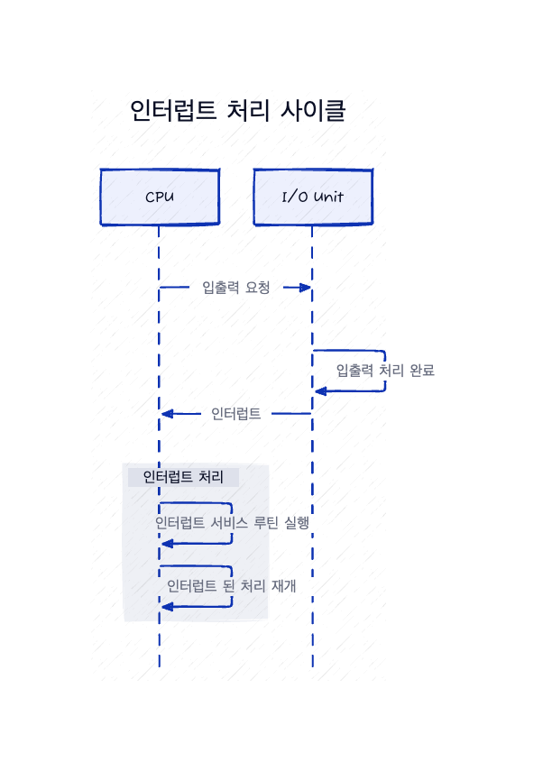

# 인터럽트

## 개요

하드웨어는 시스템 버스를 통해 CPU에 신호를 보내 인터럽트를 발생시킬 수 있다.

    

1. CPU가 인터럽트 되면 CPU는 하던 일을 중단하고 즉시 고정된 위치로 실행을 옮긴다.
2. 이러한 고정된 위치는 일반적으로 인터럽트를 위한 서비스 루틴이 위치한 시작 주소를 가지고 있다.
3. 그리고 인터럽트 서비스 루틴이 실행된다. 
4. 인터럽트 서비스 루틴의 실행이 완료되면 CPU는 인터럽트 되었던 연산을 재개한다.

인터럽트는 빠르게 처리되어야 하며, 이를 위해 인터럽트 루틴에 대한 포인터 테이블(인터럽트 벡터)이 사용된다. 이 테이블은 인터럽트를 발생시킨 장치에 맞는 서비스 루틴(인터럽트 핸들러)을 바로 호출하게 해준다. 인터럽트가 발생하면 CPU가 원래 하던 작업의 상태가 저장되고, 인터럽트 처리 후에 원래의 상태로 복원된다. 이 과정은 인터럽트가 발생하지 않았던 것처럼 연산이 이어지도록 해준다.

## 구현

기본 인터럽트 메커니즘은 다음과 같이 작동한다. CPU 하드웨어에는 IRQ(인터럽트 요청 라인, interrupt request line)라는 선이 있다.

1. 하나의 명령어의 실행을 완료할 때마다 CPU가 I/O Unit(장치 컨트롤러)가 IRQ로 보낸 신호를 감지한다.
2. CPU가 인터럽트 번호를 읽고 이 번호를 인터럽트 벡터의 인덱스로 사용하여 ISR(Interrupt Service Routine, 인터럽트 서비스 루틴)를 찾는다.
3. ISR이 실행된다.
   1. 기존의 하던 작업을 저장
   2. 인터럽트 원인 확인
   3. 인터럽트 처리
   4. 기존 상태 복원
   5. `return_from_interrupt` 명령어를 실행하여 CPU를 인터럽트 전 실행 상태로 되돌린다.

요약하면 장치 컨트롤러가 인터럽트 요청 라인에 신호를 전송 -> 인터럽트를 발생(raise) -> CPU는 인터럽트 포착(catch) -> ISR로 디스패치(dispatch) -> ISR은 장치를 서비스 후 인터럽트 제거(clear)

위의 기본 인터럽트 기법에 더해 최신 운영체제에서는 더욱 정교한 인터럽트 처리가 필요하다.
1. 중요한 처리 중에 인터럽트 처리를 연기할 수 있어야 함
2. 장치의 적절한 ISR로 효율적인 디스패치 할 방법이 필요함
3. 우선순위가 높은 인터럽트와 우선순위가 낮은 인터럽트를 운영체제가 구분하고 적절한 긴급도로 대응할 수 있도록 다단계 인터럽트가 필요함(즉 인터럽트의 우선순위가 필요함)

최신 컴퓨터 하드웨어에서 이 세가지 기능은 CPU 및 **인터럽트 컨트롤러(Interrupt Controller) 하드웨어**에 의해 제공된다.

#### IRQ의 종류
대부분의 CPU에는 2개의 IRQ가 있다. 

- **마스킹 가능 인터럽트(Maskable Interrupt)** - CPU가 무시할 수 있는 인터럽트. 일반적으로 I/O Unit이나 타이머 등과 같은 다른 하드웨어 장치로부터 발생한다.
- **마스크 불가능 인터럽트(Non-maskable Interrupt, NMI)** - CPU가 무시할 수 없는 인터럽트. 긴급한 상황이나 치명적인 에러(하드웨어 오류, 전력 문제 등)에서 발생한다. 해당 인터럽트가 발생하면 CPU는 즉시 ISR을 호출하여 해당 문제를 처리하며 이러한 인터럽트는 일반적으로 시스템을 중단시키거나 디버그 정보를 캡처하는 등 긴급한 작업을 수행한다.

#### 인터럽트 체인

하나의 인터럽트에 대해 여러 개의 ISR이 존재할 수 있다. 이를 위해 인터럽트 체인을 사용하여 하나의 인터럽트에 대해 여러 개의 IRQ를 순차적으로 호출할 수 있도록 한다.

**Intel 벡터 테이블**
|벡터 번호|설명|
|-|-|
|0|나눗셈 에러|
|1|디버그 예외|
|2|Null 인터럽트|
|3|중단점(breakpoint)|
|4|INTO-검출 오버플로|
|5|제한 범위 예외|
|6|유효하지 않은 opcode|
|7|장치 가용하지 않음|
|8|더블 폴트|
|9|부처리기 세그먼트 침범(예약됨)|
|10|유효하지 않은 태스크 상태 세그먼트|
|11|존재하지 않는 세그먼트|
|12|스택 폴트|
|13|일반 보호|
|14|페이지 폴트|
|15|(Intel에서 예약함, 사용하지 말 것)|
|16|부동소수점 에러|
|17|정렬 검사|
|18|기기 검사|
|19~31|(Intel에서 예약함, 사용하지 말 것)|
|32~255|Maskable 인터럽트|