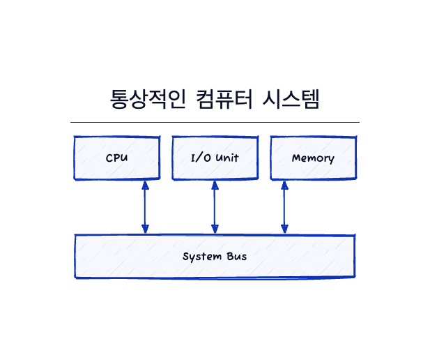
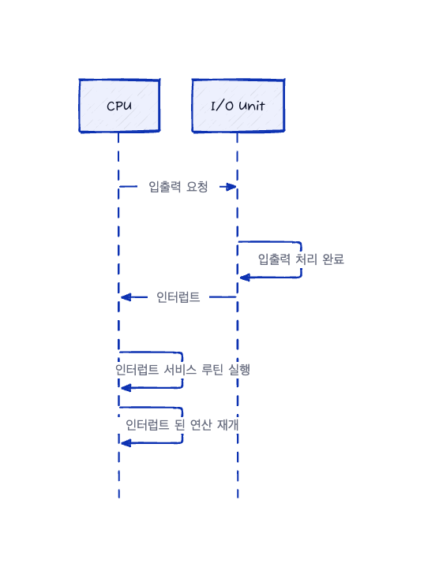

# 컴퓨터 시스템의 구성

    

현대 범용 컴퓨터 시스템은 시스템 버스를 통해 CPU, 입출력 장치(키보드, 마우스, 모니터 등), 메모리 등이 연결된다.

일반적으로 운영체제에는 각 장치 컨트롤러마다 **장치 드라이버**가 있다. 이 장치 드라이버는 장치 컨트롤러의 작동을 잘 알고 있고 나머지 운영체제에 장치에 대한 일관된 인터페이스를 제공한다. 

CPU와 장치 컨트롤러는 병렬로 실행되어 메모리 사이클을 놓고 경쟁한다. 공유 메모리를 질서 있게 액세스하기 위해 메모리 컨트롤러는 메모리에 대한 액세스를 동기화한다.

## 인터럽트

1. 장치 드라이버는 I/O 작업을 시작하기 위해 장치 컨트롤러의 레지스터에 값을 할당한다. 
2. 장치 컨트롤러는 이 값을 바탕으로 어떤 작업을 수행할지 결정한다. 
3. 작업을 결정한 후에는 장치에서 로컬 버퍼로 데이터를 전송한다. 
4. 작업이 끝나면, 장치컨트롤러는 **인터럽트**를 통해 드라이버에게 작업 완료를 알린다.

### 개요

하드웨어는 시스템 버스를 통해 CPU에 신호를 보내 인터럽트를 발생시킬 수 있다.

    

1. CPU가 인터럽트 되면 CPU는 하던 일을 중단하고 즉시 고정된 위치로 실행을 옮긴다.
2. 이러한 고정된 위치는 일반적으로 인터럽트를 위한 서비스 루틴이 위치한 시작 주소를 가지고 있다.
3. 그리고 인터럽트 서비스 루틴이 실행된다. 
4. 인터럽트 서비스 루틴의 실행이 완료되면 CPU는 인터럽트 되었던 연산을 재개한다.

인터럽트는 빠르게 처리되어야 하며, 이를 위해 인터럽트 루틴에 대한 포인터 테이블(인터럽트 벡터)이 사용된다. 이 테이블은 인터럽트를 발생시킨 장치에 맞는 서비스 루틴(인터럽트 핸들러)을 바로 호출하게 해준다. 인터럽트가 발생하면 CPU가 원래 하던 작업의 상태가 저장되고, 인터럽트 처리 후에 원래의 상태로 복원된다. 이 과정은 인터럽트가 발생하지 않았던 것처럼 연산이 이어지도록 해준다.

### 구현

기본 인터럽트 메커니즘은 다음과 같이 작동한다. CPU 하드웨어에는 인터럽트 요청 라인(interrupt request line)이라는 선이 있다.

1. 하나의 명령어의 실행을 완료할 때마다 CPU가 인터럽트 요청 라인(interrupt request line)을 감지한다.
2. 장치 컨트롤러가 인터럽트 요청 라인에 신호를 보낸 것을 감지하면 CPU가 인터럽트 번호를 읽고 이 번호를 인터럽트 벡터의 인덱스로 사용하여 인터럽트 핸들러 루틴(interrupt-handler routine)으로 점프한다.
3. 해당 인덱스와 관련된 주소에서 실행을 시작한다. 
4. 인터럽트 처리기가 수행된다.
   1. 작업 중에 변경될 상태를 저장
   2. 인터럽트 원인을 확인
   3. 필요한 처리를 수행
   4. 상태를 복원을 수행
   5. return_from_interrupt 명령어를 실행하여 CPU를 인터럽트 전 실행 상태로 되돌린다.

요약하면 장치 컨트롤러가 인터럽트 요청 라인에 신호를 선언 -> 인터럽트를 발생(raise) -> CPU는 인터럽트 포착(catch) -> 인터럽트 핸들러로 디스패치(dispatch) -> 핸들러는 장치를 서비스 후 인터럽트를 제거(clear)

위의 기본 인터럽트 기법에 더해 최신 운영체제에서는 더욱 정교한 인터럽트 처리가 필요하다.
1. 중요한 처리 중에 인터럽트 처리를 연기할 수 있어야 함
2. 장치의 적절한 인터럽트 핸들러로 효율적인 디스패치 할 방법이 필요함
3. 우선순위가 높은 인터럽트와 우선순위가 낮은 인터럽트를 운영체제가 구분하고 적절한 긴급도로 대응할 수 있도록 다단계 인터럽트가 필요함

최신 컴퓨터 하드웨어에서 이 세가지 기능은 CPU 및 **인터럽트 컨트롤러 하드웨어**에 의해 제공된다.

대부분의 CPU에는 2개의 인터럽트 요청 라인이 있다. 
- 복구할 수 없는 메모리 오류와 같은 이벤트를 위해 예약된 **마스크 불가능 인터럽트(nonmaskable interrupt)** 이다. 
- 인터럽트 되어서는 안되는 중요한 명령 시퀀스를 실행하기 전에 CPU에 의해 꺼질 수 있기 때문에 장치 컨트롤러가 서비스를 요청하기 위해 **마스킹 가능 인터럽트(maskable interrupt)** 가 사용된다. 

