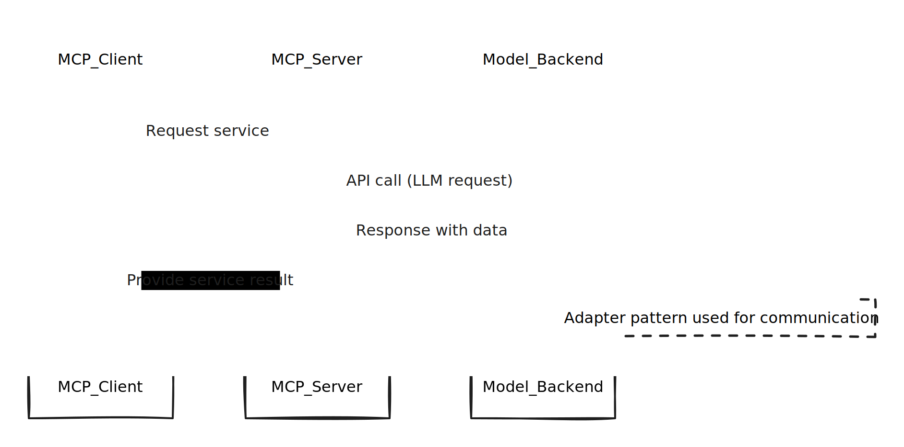

# MCP(Model Context Protocal)

크게 3가지 용어가 존재하며, LLM 서버를 의미하는 Model Backend라는 용어는 사용하는 문맥에 따라 달라질 수 있음.

* MCP Client - MCP Server를 사용하는 주체, 즉 IntelliJ, Claude Desktop, Obsidian
* MCP Server - LLM 서버를 호출하여 Client에 서비스를 제공하는 서버
* Model Backend - LLM 서버

여러 용어가 존재해서 뭔가 거창하지만, 일반적인 서버와 클라이언트 개념과 API Provider 개념과 동일하다.

즉 백엔드가 서버를 개발해서 프론트엔드(Client)에게 서비스를 제공하는데 일반적으로 API 스펙을 백엔드가 정하는데, 이것을 표준화시킨 것이다.

MCP 서버와 Model Backend 간의 통신 규격은 느슨한 표준화로 이루어지는데, 이 때 일반적으로 Model Backend Adaptar 패턴을 거의 필수적으로 사용하게 된다.\

즉 일반적으로 백엔드가 타사 API 서버를 연동할 때 사용하듯이 중간에 우리쪽 코드와 이어주는 어댑터 코드를 작성하는 것이다. Model Backend와 MCP 서버간의 통신도 강한 표준화가 이루어지면 좋겠지만, Model Backend 간 지원하는 고유 기능이 다르기 때문에 어댑터 계층은 앞으로도 필요할 것으로 보인다 (function calling, tool use, grounding 방식 등)

앞으로 백엔드 개발자로서 MCP를 통해 AI 서비스를 개발하게 된다면, MCP 서버를 개발하는 역할을 맡을 확률이 높다. (사실, 현재 백엔드가 맡고 있는 역할과 본질적으로 크게 다르지 않다.)

Model Backend는 AI 엔지니어가 파인튜닝하여 서비스에 최적화된 모델을 개발할 수 있지만, 이는 백엔드 개발자의 역할이 아니라, **모델을 활용하는 클라이언트로서의 역할**이 될 것이다.

### 참고

[https://modelcontextprotocol.io/quickstart/server](https://modelcontextprotocol.io/quickstart/server)
